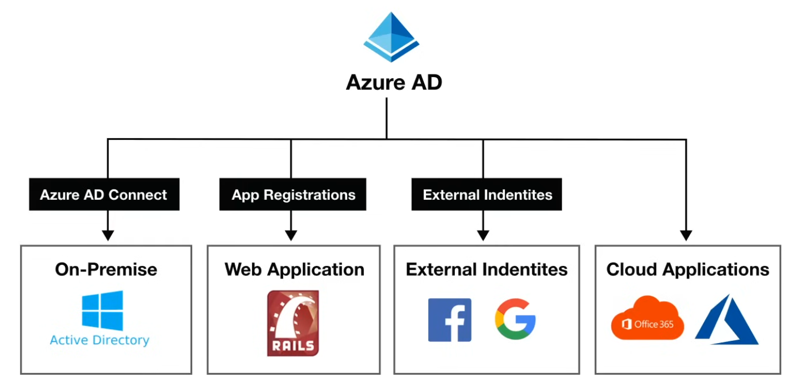

# Azure Active Directory (AD)

**Azure Active Directory (Azure AD)** is Microsoft's cloud-based `Identity and Access Management (IAM)` service, that helps your users sign-in and access resources.
- External Resources
  - Microsoft Office 365
  - Azure Portal
  - SaaS applications
- Internal Resources
  - Applications within your internal networking
  - Access to workstations on-premise
- Use Azure AD to implement `Single-Sign On (SSO)`

#### Azure AD comes in four editions
- **Free** MFA, SSO, Basic Security and Usage Reports, User Management
- **Office 365 Apps** Company Branding, SLA, Two-Sync between on-premise and Cloud
- **Premium 1** Hybrid Architecture, Advanced Group Access, Conditional Access
- **Premium 2** Identity protection, Identity Governance

## Azure AD Use Cases
**Azure AD** can `authorize` and `authenticate` to multiple sources.
- To your on-prem AD
- To your web-application
- Allow users to login with the Identity provider (IdP) like Facebook or Google
- To `Office365` or `Azure Microsoft`

