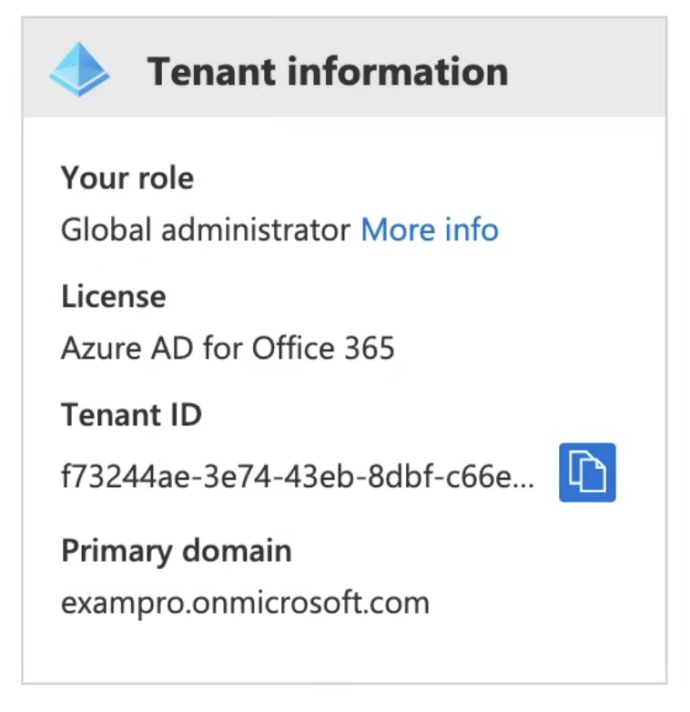

# Azure Active Directory (AD)

**Azure Active Directory (Azure AD)** is Microsoft's cloud-based `Identity and Access Management (IAM)` service, that helps your users sign-in and access resources.
- External Resources
  - Microsoft Office 365
  - Azure Portal
  - SaaS applications
- Internal Resources
  - Applications within your internal networking
  - Access to workstations on-premise
- Use Azure AD to implement `Single-Sign On (SSO)`

#### Azure AD comes in four editions
- **Free** MFA, SSO, Basic Security and Usage Reports, User Management
- **Office 365 Apps** Company Branding, SLA, Two-Sync between on-premise and Cloud
- **Premium 1** Hybrid Architecture, Advanced Group Access, Conditional Access
- **Premium 2** Identity protection, Identity Governance

## Azure AD Use Cases
**Azure AD** can `authorize` and `authenticate` to multiple sources.
- To your on-prem AD
- To your web-application
- Allow users to login with the Identity provider (IdP) like Facebook or Google
- To `Office365` or `Azure Microsoft`

## Active Directory vs Azure Active Directory
- Microsoft introduced `Active Directory` Domain Services in Windows 2000 to give organizations the ability to managed multiple on-prem infrastructure components and systems using a single identity per user.
- **Azure AD** takes this approach to the next level by providing organizations with an `Identity as a Service (IDaas)` solution for all their apps `across Cloud and On-Premises`
- Both versions are actively used
  - **Active Directory** -> The `on-premise` version
  - **Azure Active Directory (Azure AD)** -> The `Cloud` version

## Active Directory Terminology
- Domain
  - A Domain is an area of network organized by a single authentication database
  - An `Active Directory Domain` is a *logical grouping* of AD objects on a network
- Domain Controller (DC)
  - is a server that `authenticates` user identities and `authorizes` their access to reources
- Domain Computer
  - is a computer that is registered with a central authentication database. A Domain Computer would be an `AD Object`
- AD Object
  - is the basic element of AD such as: Users, Groups, Printers, Computers, Shared folders
- Group Policy Object (GPO)
  - is a virtual collection of policy settings. It controls what the AD Objects have access to.
- Organizational Units
  - A subdivision within an AD into which you can place users, groups, computers and other Organizational Units.
- Directory Service
  - A directory service, such as Active Directory Domain Services(AD DS), provides the methods for storing directory data and making this data available to network users and administrators. A Directory Service runs on a Domain Controller (DC).

## Azure AD - Tenant
- A Tenant represents an Organization within Azure Active Directory
- A Tenant is a dedicated Azure AD Service Instance
- A Tenant is automatically created when you sign up for either:
  - Microsoft Azure
  - Microsoft Intune
  - Microsoft 365
- Each Azure AD tenant is distincy and separate from other Azure AD tenants.

## Azure Active Directory Domain Services(AD DS)
In some cases, you may need to setup your own Domain Controller (DC). For instance, when doing `lift-and-shift on-premise` to Microsoft Azure and migrating Active Directory, Azure AD does not support some `domain services`.
- Azure AD DS provides `managed domain service` such as:
  - Domain Joins
  - Group policies
  - Lightweight Directory Access Protocol (LDAP) and,
  - Kerberos / NTLM authentication

> You can use these domain services without the need to `deploy, manage` or `patch` **Domain Controllers** in the cloud.

## Azure AD Connect
**Azure AD Connect** is a `hybrid service` to connect your on-prem AD to Azure Account. It allows for seamless `Single SignOn` from your on-prem workstation to Microsoft Azure.

Azure AD Connect has the following features:
- **Password hash synchronization** - sign-in method, syncs a hash of users' on-prem AD password with Azure AD.
- **Pass-through authentication** - sign-in method, allows users to use the same password on-prem and in the cloud.
- **Federation Integration** - hybrid environment using an on-prem AD FS(Federation Services) infrastructure, for certification renewal
- **Synchronization** - Responsible for creating users, groups, and other objects. Ensures on-prem and cloud data matches.
- **Health Monitoring** - robust monitoring and proviedes a central location in the Azure Portal (think `Azure AD Connect Health`) to view this activity.

## Active Directory - Users
**Users** represents an `identity for a person or employee` in your domain. A user has login credentials and can use them to login to Azure portal.
- You can:
  - assign roles such as `AdminRole` to users
  - add users to Groups
  - enforce authentication methods such as Multi-factor authentication(MFA)
  - track user sign-ins
  - track devices that users use to login and allow/deny devices
  - assign `Microsoft Licenses`
- Azure AD has two kinds of users:
  - **Users** - A user belongs to your Organazation
  - **Guest Users** - A Guest user belongs to another Organization

## Active Directory - Groups
**Groups** lets the resource owner (or the Azure AD directory owner) assign a set of access permissions to all the members of a group, instead of having to provide the rights individually.

Groups contain:
- **Owners** - Has permissions to add/remove members
- **Members** - Has permissions to do things

Assignment:
- You can assign roles directly to a group
- You can assign applications directly to a group

#### Request to Join Groups
The group owner can let users find their own groups to join, instead of assigning them. The owner can also setup the Group to automatically accept all users that join or require approval.

## Azure AD - Assign Access Rights
There are four ways to `assign resource access rights` to your users:
- **Direct Assignment** - The Resource Owner directly assigns the user to the resource.
- **Group Assignment** - The Resource Owner assigns an Azure AD group to the resource, which automatically gives all of the group members access to the resource.
- **Rule-based Assignment** - The Resource Owner creates a group and uses a rule to define which users are assigned to a specific resource.
- **External Authority Assignment** - Access comes from an external resource, such as an on-premises directory or a SaaS app.

## Azure AD - External Identities
**External Identities** in Azure AD, allow people outside your organization to access your apps and resources, while letting them sign in using whatever identities they prefer.

Your partners, distributors, suppliers, vendors and other guests can `bring their own identities`.
- Supports login from IdPs like Google or Facebook
- Allows to share apps with external users (B2B collaboration).
- Develop apps intended for other Azure AD tenants (single tenant or multi-tenant).
- Develop white-labeled apps for consumers and customers (Azure AD B2C).

